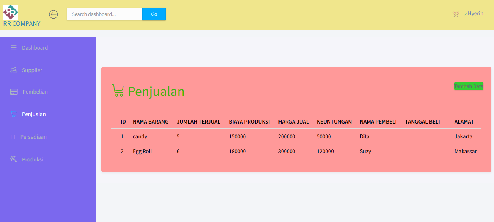

## Deskripsi

Tugas Mata Kuliah Sistem Informasi Akuntansi. Sistem ini berisi informasi terkait penjualan barang, pembelian bahan, dan produksi barang yang membantu mencatat transaksi usaha. Sistem ini masih sederhana dan masih perlu dikembangkan. 

## Output

## Learning Laravel

Laravel has the most extensive and thorough [documentation](https://laravel.com/docs) and video tutorial library of all modern web application frameworks, making it a breeze to get started with the framework.

If you don't feel like reading, [Laracasts](https://laracasts.com) can help. Laracasts contains over 1500 video tutorials on a range of topics including Laravel, modern PHP, unit testing, and JavaScript. Boost your skills by digging into our comprehensive video library.
